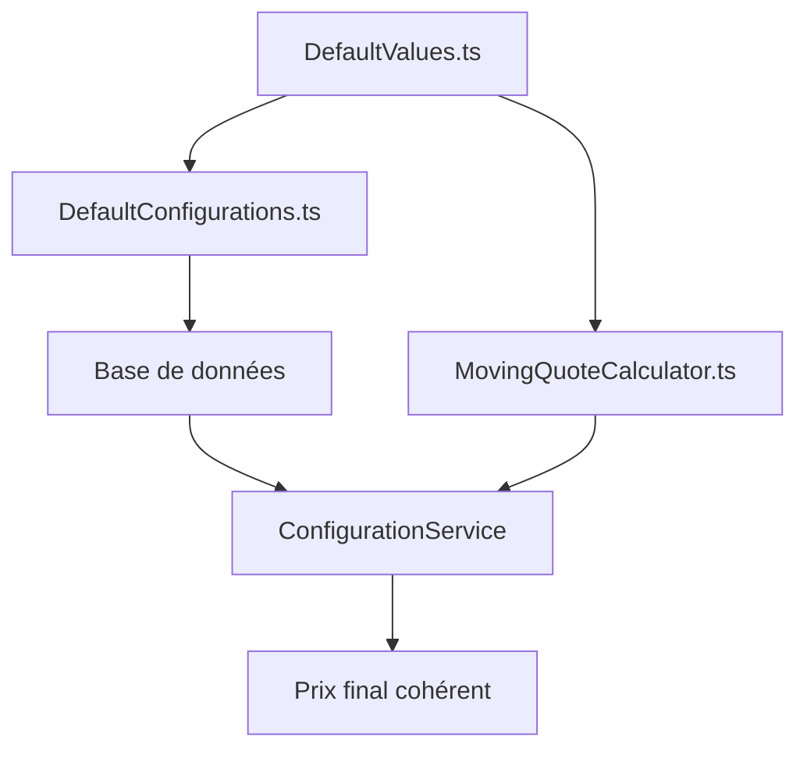

# 🚨 Problème de cohérence des configurations

## 📋 Problème identifié

Le système actuel a **3 sources de vérité différentes** pour les mêmes valeurs de configuration, créant des incohérences potentielles.

## 🔍 Exemple concret : `MOVING_BASE_PRICE_PER_M3`

### Sources actuelles :

1. **DefaultConfigurations.ts** : `10€/m³`
2. **MovingQuoteCalculator.ts** (fallback) : `50€/m³`  
3. **Base de données** : Variable selon admin

### Code problématique :

```typescript
// ❌ PROBLÈME : Deux valeurs différentes pour la même configuration

// Dans DefaultConfigurations.ts (ligne 12)
createPricingConfig(PricingConfigKey.MOVING_BASE_PRICE_PER_M3, 10)  // 10€

// Dans MovingQuoteCalculator.ts (ligne 151)
const pricePerM3 = this.configService.getNumberValue(
  PricingConfigKey.MOVING_BASE_PRICE_PER_M3, 
  50  // ← INCOHÉRENT ! Devrait être 10€
);
```

## 🎯 Scénarios problématiques

### Scénario 1 : Modification des DefaultConfigurations
```
DefaultConfigurations.ts : 10€ → 33€
MovingQuoteCalculator.ts : 50€ (inchangé)

Résultat :
- BDD OK → 33€ ✅
- BDD KO → 50€ ❌ (Incohérent avec la config par défaut !)
```

### Scénario 2 : Admin modifie en base
```
Base de données : 25€ (admin)
DefaultConfigurations.ts : 10€
MovingQuoteCalculator.ts : 50€

Résultat :
- BDD OK → 25€ ✅
- BDD KO → 50€ ❌ (L'admin croit avoir 25€, mais obtient 50€ !)
```

### Scénario 3 : Développeur modifie le fallback
```
MovingQuoteCalculator.ts : 50€ → 15€
DefaultConfigurations.ts : 10€ (inchangé)

Résultat :
- Nouvelle installation → 10€ (depuis DefaultConfigurations)
- Panne temporaire → 15€ (depuis fallback)
- Incohérence selon le contexte !
```

## ✅ Solution recommandée

### 1. **Source unique de vérité**

```typescript
// ✅ SOLUTION : Une seule valeur de référence

export class DefaultValues {
  static readonly MOVING_BASE_PRICE_PER_M3 = 10;
  static readonly MOVING_DISTANCE_PRICE_PER_KM = 2;
  static readonly FUEL_CONSUMPTION_PER_100KM = 25;
  // ... autres valeurs
}
```

### 2. **DefaultConfigurations.ts utilise les constantes**

```typescript
// DefaultConfigurations.ts
import { DefaultValues } from './DefaultValues';

export function createDefaultConfigurations(): Configuration[] {
  const configurations: Configuration[] = [];
  
  configurations.push(createPricingConfig(
    PricingConfigKey.MOVING_BASE_PRICE_PER_M3, 
    DefaultValues.MOVING_BASE_PRICE_PER_M3  // ← Source unique
  ));
  
  return configurations;
}
```

### 3. **MovingQuoteCalculator utilise les mêmes constantes**

```typescript
// MovingQuoteCalculator.ts
import { DefaultValues } from '../configuration/DefaultValues';

private calculateVolumeCost(volume: number): number {
  const pricePerM3 = this.configService.getNumberValue(
    PricingConfigKey.MOVING_BASE_PRICE_PER_M3, 
    DefaultValues.MOVING_BASE_PRICE_PER_M3  // ← Même source !
  );
  return volume * pricePerM3;
}
```

## 🔄 Flux cohérent



## 📊 Comparaison avant/après

| Situation | Avant | Après |
|-----------|-------|-------|
| **BDD OK** | Valeur BDD | Valeur BDD |
| **BDD KO** | Fallback incohérent | Fallback cohérent |
| **Nouvelle install** | Default 10€ | Default 10€ |
| **Panne temporaire** | Fallback 50€ ❌ | Fallback 10€ ✅ |
| **Modification** | 3 endroits à changer | 1 seul endroit |

## 🛠️ Plan d'implémentation

### Étape 1 : Créer DefaultValues.ts
```typescript
export class DefaultValues {
  // MOVING
  static readonly MOVING_BASE_PRICE_PER_M3 = 10;
  static readonly MOVING_DISTANCE_PRICE_PER_KM = 2;
  static readonly FUEL_CONSUMPTION_PER_100KM = 25;
  static readonly FUEL_PRICE_PER_LITER = 1.8;
  static readonly TOLL_COST_PER_KM = 0.15;
  static readonly HIGHWAY_RATIO = 0.7;
  
  // PACK
  static readonly PACK_WORKER_PRICE = 120;
  static readonly PACK_INCLUDED_DISTANCE = 20;
  static readonly PACK_EXTRA_KM_PRICE = 1.5;
  static readonly PACK_LIFT_PRICE = 200;
  
  // SERVICE
  static readonly SERVICE_WORKER_PRICE_PER_HOUR = 35;
}
```

### Étape 2 : Refactorer DefaultConfigurations.ts
```typescript
import { DefaultValues } from './DefaultValues';

configurations.push(createPricingConfig(
  PricingConfigKey.MOVING_BASE_PRICE_PER_M3, 
  DefaultValues.MOVING_BASE_PRICE_PER_M3
));
```

### Étape 3 : Refactorer MovingQuoteCalculator.ts
```typescript
import { DefaultValues } from '../configuration/DefaultValues';

private calculateVolumeCost(volume: number): number {
  const pricePerM3 = this.configService.getNumberValue(
    PricingConfigKey.MOVING_BASE_PRICE_PER_M3, 
    DefaultValues.MOVING_BASE_PRICE_PER_M3
  );
  return volume * pricePerM3;
}
```

### Étape 4 : Identifier tous les fallbacks incohérents
```bash
# Rechercher tous les getNumberValue avec des valeurs codées en dur
grep -r "getNumberValue.*[0-9]" src/
```

## ✅ Avantages de la solution

- 🎯 **Source unique** : Une seule valeur à maintenir
- 🔒 **Cohérence** : Fallback = Default toujours
- 🛠️ **Maintenabilité** : Un seul endroit à modifier
- 🧪 **Testabilité** : Valeurs constantes pour les tests
- 📊 **Prévisibilité** : Comportement identique en toute situation

## 🚨 Risques actuels

Sans cette correction :
- **Incohérence prix** selon l'état de la BDD
- **Confusion admin** : prix configuré ≠ prix appliqué en panne
- **Bugs difficiles** à reproduire (dépendent de l'état système)
- **Maintenance complexe** : 3 endroits à synchroniser

## 🎯 Conclusion

Le problème identifié est un **défaut d'architecture** critique qui peut causer des incohérences de prix selon l'état du système. La solution proposée garantit une cohérence parfaite entre toutes les sources de configuration. 