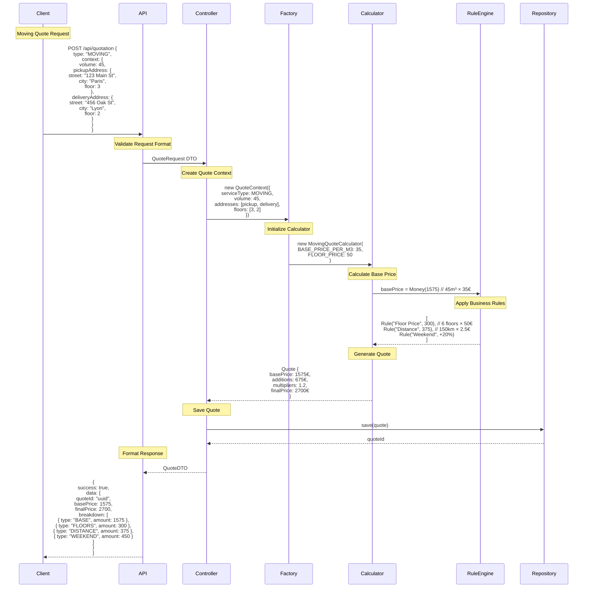
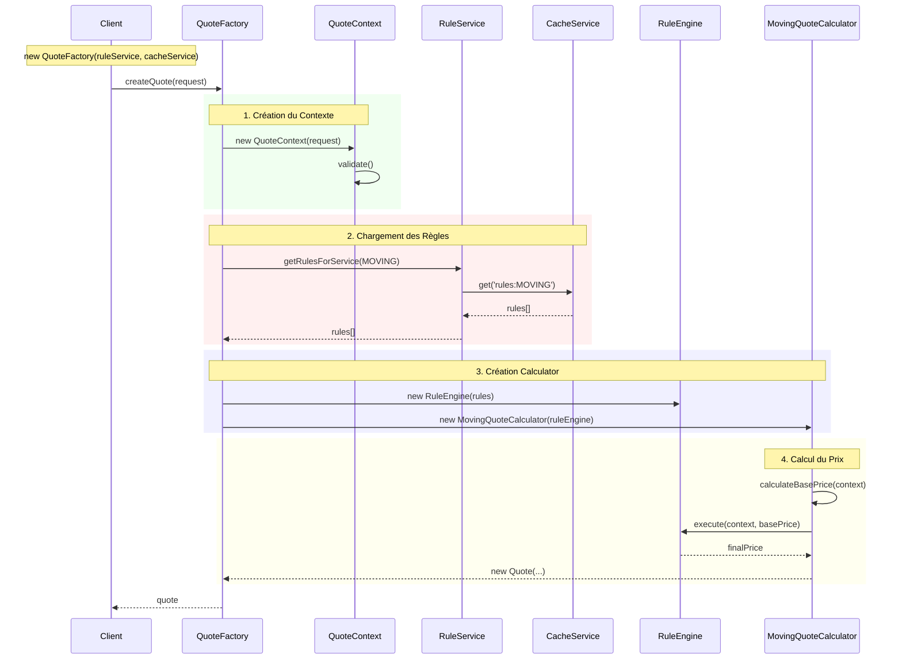

# Quote Calculation System Documentation

## Architecture Overview

### Clean Architecture Layers

1. **Presentation Layer** (`src/quotation/interfaces/`)
   - HTTP API endpoints
   - Request/Response DTOs
   - Error handling

2. **Application Layer** (`src/quotation/application/`)
   - Quote calculation orchestration
   - Professional management
   - Service coordination

3. **Domain Layer** (`src/quotation/domain/`)
   - Business logic and rules
   - Entities and Value Objects
   - Domain services

4. **Infrastructure Layer** (`src/quotation/infrastructure/`)
   - Database access
   - External services integration
   - Caching implementation

## Core Components

### 1. Entities

#### Professional
```typescript
// Basic creation
const professional = new Professional(contactInfo);

// With initial service
const professional = new Professional(contactInfo, service);

// Full configuration
const professional = new Professional({
  contactInfo,
  address,
  services: [ServiceType.CLEANING],
  rating: 4.5,
  isAvailable: true
});
```

#### Service
```typescript
const service = new Service(
  name,       // Service name
  type,       // CLEANING or MOVING
  basePrice   // Money value object
);
```

### 2. Value Objects

#### QuoteContext
- Holds all quote calculation parameters
- Validates input data
- Type-safe access to properties

#### Money
- Represents monetary values
- Handles currency operations
- Ensures value integrity

### 3. Business Rules

#### Rule Engine
```typescript
class RuleEngine {
  constructor(private rules: Rule[]) {}
  execute(context: QuoteContext): void {
    // Rules are applied in order
    this.rules.forEach(rule => rule.apply(context));
  }
}
```

## Main Workflows

### 1. Quote Calculation (Moving Service Example)



Cette séquence illustre :
1. La requête initiale avec les détails du déménagement
2. La création du contexte avec les données validées
3. Le calcul du prix de base (45m³ × 35€/m³ = 1575€)
4. L'application des règles métier :
   - Prix des étages : 6 étages × 50€ = 300€
   - Prix de la distance : 150km × 2.5€/km = 375€
   - Majoration weekend : +20% sur le total
5. La génération du devis final avec le détail des calculs
6. La sauvegarde et le retour de la réponse formatée

### 2. Professional Management

1. **Service Management**
```typescript
professional.addService(ServiceType.CLEANING);
professional.removeService(ServiceType.MOVING);
```

2. **Quote Assignment**
```typescript
professional.assignQuote(quote);
professional.completeQuote(quoteId);
```

## Validation Rules

1. **Professional**
   - Rating: 0-5 range
   - Valid contact information
   - Valid service types

2. **Quote**
   - Valid service type
   - Required parameters
   - Business rule compliance

## Error Handling

```typescript
class DomainError extends Error {}
class ValidationError extends DomainError {}
class BusinessRuleError extends DomainError {}
```

## Testing Strategy

1. **Domain Tests**
   - Entity behavior
   - Value object validation
   - Business rules

2. **Integration Tests**
   - Quote calculation flow
   - Professional management
   - Rule application

For detailed implementation examples and API documentation, see the respective test files in `src/quotation/domain/__tests__/`.

# Flux d'Exécution de QuoteFactory

Ce document détaille la cascade complète d'appels de méthodes lors de la création d'un devis, depuis l'instanciation de QuoteFactory jusqu'au calcul final.


## Diagramme de Séquence




## Cascade d'Appels Détaillée

### 1. QuoteFactory.createQuote()
```typescript
// Appel initial avec les données de la requête
await factory.createQuote({
    serviceType: ServiceType.MOVING,
    context: {
        volume: 45,
        addresses: {
            pickup: { street: "123 Main St", city: "Paris" },
            delivery: { street: "456 Oak St", city: "Lyon" }
        },
        floors: { pickup: 3, delivery: 2 }
    }
});
```
- Point d'entrée du flux
- Coordonne tout le processus de création du devis

### 2. QuoteContext.constructor()
```typescript
// Construction du contexte avec les données validées
const context = new QuoteContext({
    serviceType: ServiceType.MOVING,
    volume: 45,
    addresses: {...},
    floors: {...}
});
```
- Crée un objet immuable contenant toutes les données nécessaires
- Prépare les données pour la validation

### 3. QuoteContext.validate()
```typescript
// Validation des données du contexte
context.validate();
```
- Vérifie que serviceType est valide
- Vérifie que les données requises sont présentes
- Valide le format des données selon le type de service
- Lance une ValidationError si les données sont invalides

### 4. RuleService.getRulesForService()
```typescript
// Récupération des règles pour le service de déménagement
const rules = await ruleService.getRulesForService(ServiceType.MOVING);
```
- Tente d'abord de récupérer les règles du cache
- Si non trouvées, charge les règles depuis la base de données
- Retourne un tableau de Rule[]

### 5. CacheService.get()
```typescript
// Tentative de récupération des règles en cache
const cachedRules = await cacheService.get('rules:MOVING');
```
- Vérifie si les règles sont en cache
- Retourne null si non trouvées
- Optimise les performances en évitant des appels DB répétés

### 6. RuleEngine.constructor()
```typescript
// Création du moteur de règles avec les règles chargées
const ruleEngine = new RuleEngine(rules);
```
- Initialise le moteur avec les règles métier
- Prépare l'environnement d'exécution des règles
- Organise les règles selon leur priorité

### 7. MovingQuoteCalculator.constructor()
```typescript
// Création du calculateur spécifique au déménagement
const calculator = new MovingQuoteCalculator(ruleEngine);
```
- Initialise le calculateur avec le moteur de règles
- Configure les constantes spécifiques (prix au m³, etc.)
- Hérite de AbstractQuoteCalculator

### 8. MovingQuoteCalculator.calculate()
```typescript
// Lancement du calcul du devis
const quote = await calculator.calculate(context);
```
- Point d'entrée du processus de calcul
- Coordonne le calcul du prix de base et l'application des règles
- Retourne un objet Quote

### 9. MovingQuoteCalculator.calculateBasePrice()
```typescript
// Calcul du prix de base selon le volume et les étages
const basePrice = calculator.calculateBasePrice(context);
```
- Extrait le volume du contexte (45m³)
- Applique le prix au m³ (ex: 35€/m³)
- Ajoute les coûts fixes (étages, etc.)
- Retourne un objet Money

### 10. RuleEngine.execute()
```typescript
// Application séquentielle des règles métier
const finalPrice = await ruleEngine.execute(context, basePrice);
```
- Prend le prix de base comme point de départ
- Applique chaque règle dans l'ordre
- Accumule les modifications de prix
- Retourne le prix final

### 11. Rule.apply()
```typescript
// Application de chaque règle individuelle
rules.forEach(rule => rule.apply(price, context));
```
- Vérifie si la règle s'applique au contexte
- Calcule la modification de prix
- Peut être une augmentation ou une réduction
- Retourne le nouveau prix après application

### 12. Quote.constructor()
```typescript
// Création de l'objet devis final
return new Quote(
    basePrice,    // Prix de base calculé
    finalPrice,   // Prix après application des règles
    context,      // Contexte original
    rules         // Règles appliquées
);
```
- Crée l'objet devis immutable
- Stocke toutes les informations du calcul
- Permet de tracer les modifications de prix

## Points Clés

Cette cascade d'appels assure :
- La validation complète des données
- Le chargement optimisé des règles (avec cache)
- Le calcul précis selon le type de service
- L'application correcte des règles métier
- La traçabilité du calcul
- L'immutabilité des données

Chaque étape est isolée et a une responsabilité unique, facilitant la maintenance et les tests.

class QuoteFactory {
    constructor(
        private ruleService: RuleService,     // Infrastructure
        private cacheService: CacheService    // Infrastructure
    ) {}

    async createQuote(request: QuoteRequest) { // Presentation -> Application
        // 1. Création du contexte (Domain)
        const context = new QuoteContext(request);

        // 2. Chargement des règles (Infrastructure)
        const rules = await this.loadRules(context.getServiceType());

        // 3. Création du moteur de règles (Domain)
        const ruleEngine = new RuleEngine(rules);

        // 4. Création du calculateur (Domain)
        const calculator = this.createCalculator(context.getServiceType(), ruleEngine);

        // 5. Calcul du devis (Domain)
        return calculator.calculate(context);
    }
}