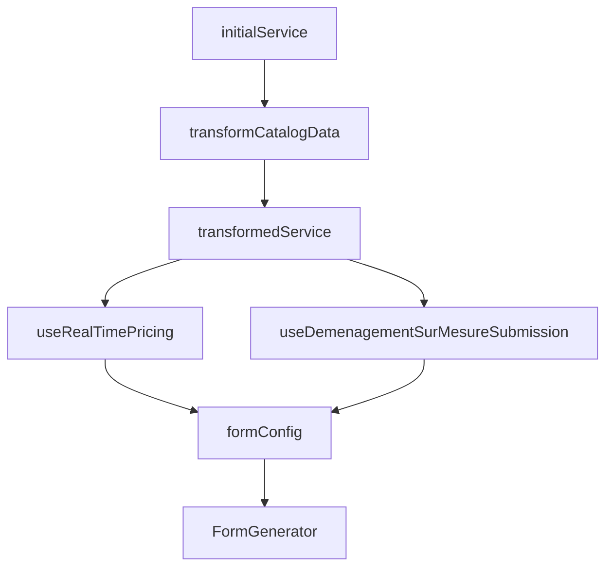

# Flux de Construction du Formulaire Déménagement Sur Mesure

Ce document détaille le flux complet de construction du formulaire dans `src/app/catalogue/catalog-demenagement-sur-mesure/page.tsx`.

## Table des Matières

- [1. Initialisation et Configuration de Base](#1-initialisation-et-configuration-de-base)
- [2. Gestion de l'État](#2-gestion-de-létat)
- [3. Transformation des Données](#3-transformation-des-données)
- [4. Configuration du Prix](#4-configuration-du-prix)
- [5. Configuration de la Soumission](#5-configuration-de-la-soumission)
- [6. Configuration du Formulaire](#6-configuration-du-formulaire)
- [7. Structure du Rendu](#7-structure-du-rendu)
- [8. Flux de Données](#8-flux-de-données)
- [9. Cycle de Vie](#9-cycle-de-vie)
- [10. Interactions Utilisateur](#10-interactions-utilisateur)
- [11. Layout et Style](#11-layout-et-style)

## 1. Initialisation et Configuration de Base

```typescript
// 1. Données initiales du service
const initialService = {
  id: "demenagement-sur-mesure",
  name: "Déménagement Sur Mesure",
  description: "Service de déménagement personnalisé selon vos besoins",
  price: null,
  duration: null,
  workers: null,
  features: ["Service personnalisé", "Devis adapté"],
  includes: ["Étude gratuite", "Options modulables"],
  serviceType: "demenagement-sur-mesure",
  isPremium: true,
  requiresVolume: true,
  requiresCustomPricing: true,
  isDynamicPricing: true,
};
```

## 2. Gestion de l'État

```typescript
// États React
const [isSubmitting, setIsSubmitting] = useState(false);
const [isClient, setIsClient] = useState(false);

// Hydration
useEffect(() => {
  setIsClient(true);
}, []);
```

## 3. Transformation des Données

```typescript
// Transformation du service en format compatible
const transformedService = transformCatalogDataToDemenagementSurMesure({
  catalogSelection: {
    id: initialService.id,
    category: "DEMENAGEMENT",
    subcategory: "sur-mesure",
    marketingTitle: initialService.name,
    marketingDescription: initialService.description,
    marketingPrice: 0,
    isFeatured: true,
    isNewOffer: false,
  },
  item: initialService,
  template: null,
});
```

## 4. Configuration du Prix

```typescript
// Hook de calcul de prix en temps réel
const priceCalculator = useRealTimePricing(
  ServiceType.MOVING_PREMIUM,
  0, // Prix de base
  transformedService.__presetSnapshot,
);

// Handler de prix calculé
const handlePriceCalculated = async (price: number, details: any) => {
  console.log("💰 Prix calculé:", price, details);
};
```

## 5. Configuration de la Soumission

```typescript
// Hook de soumission
const submissionHook = useDemenagementSurMesureSubmission(
  transformedService,
  priceCalculator.calculatedPrice,
  0, // Distance initiale
);

// Handler de soumission
const handleSubmitSuccess = async (data: any) => {
  setIsSubmitting(true);
  try {
    await submissionHook.submit(data);
    toast.success("Demande créée avec succès !");
  } catch (error) {
    const errorMessage =
      error instanceof Error
        ? error.message
        : "Erreur lors de la création de la demande";
    toast.error(`Erreur: ${errorMessage}`);
  } finally {
    setIsSubmitting(false);
  }
};
```

## 6. Configuration du Formulaire

```typescript
// Configuration via le preset
const formConfig = getDemenagementSurMesureServiceConfig({
  service: transformedService,
  onPriceCalculated: handlePriceCalculated,
  onSubmitSuccess: handleSubmitSuccess,
  onError: handleError,
});
```

## 7. Structure du Rendu

```typescript
return (
  <>
    {/* Styles globaux */}
    <FormStylesSimplified globalConfig={globalFormPreset} />

    {/* Navigation */}
    <div className="max-w-7xl mx-auto px-4 sm:px-6 lg:px-8 py-4">
      <nav className="flex items-center space-x-2 text-sm text-gray-600">
        {/* Breadcrumb */}
      </nav>
    </div>

    {/* Formulaire */}
    <div className="max-w-7xl mx-auto px-4 sm:px-6 lg:px-8 py-8">
      <FormGenerator
        config={{
          ...formConfig,
          isLoading: isSubmitting,
          layout: {
            ...formConfig.layout,
            showPriceCalculation: true,
            showConstraintsByAddress: true,
            showModificationsSummary: true,
            serviceInfo: {
              name: transformedService.name,
              description: transformedService.description,
              icon: '🚛',
              features: transformedService.includes
            }
          }
        }}
      />
    </div>
  </>
);
```

## 8. Flux de Données



## 9. Cycle de Vie

1. Initialisation du composant
2. Attente de l'hydration (`isClient`)
3. Transformation des données
4. Configuration du prix et de la soumission
5. Génération de la configuration du formulaire
6. Rendu du formulaire avec le layout sidebar

## 10. Interactions Utilisateur

1. Modification des champs → `handleFormDataChange`
2. Calcul de prix → `handlePriceCalculated`
3. Soumission → `handleSubmitSuccess`
4. Erreurs → `handleError`

## 11. Layout et Style

- Layout principal dans `layout.tsx`
- Styles globaux via `FormStylesSimplified`
- Layout sidebar pour le formulaire
- Responsive design intégré

### Avantages de cette Structure

- ✅ Séparation claire des responsabilités
- ✅ Gestion efficace des états
- ✅ Expérience utilisateur fluide
- ✅ Maintenance facilitée
- ✅ Réutilisation optimale des composants
