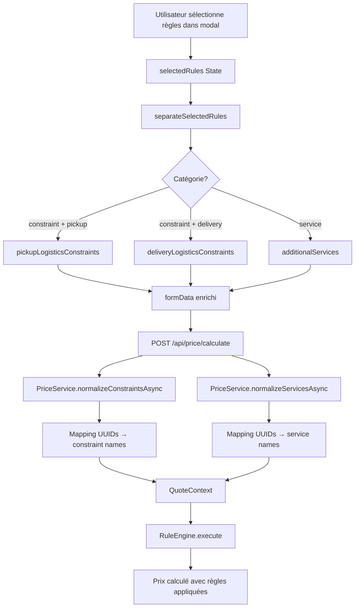

# Frontend: Intégration des Services Supplémentaires

## ✅ Backend Complété

Le backend est maintenant prêt à recevoir et traiter les services supplémentaires:
- Nouveau champ `additionalServices` dans `PriceService`
- Mapping automatique des UUIDs vers les noms de services via `normalizeServicesAsync()`
- Support complet pour tous les types de services (piano, fragile, démontage, etc.)

## 📋 Ce qui reste à faire côté Frontend

### 1. Utilitaire de Séparation des Règles

**Fichier créé**: `src/utils/rulesSeparation.ts`

Cette fonction sépare les `selectedRules` en trois catégories:
- `pickupConstraints`: Contraintes liées à l'adresse de départ
- `deliveryConstraints`: Contraintes liées à l'adresse d'arrivée
- `additionalServices`: Services supplémentaires globaux

```typescript
import { separateSelectedRules } from '@/utils/rulesSeparation';

const separated = separateSelectedRules(selectedRules, allRules);
// {
//   pickupConstraints: { 'uuid-1': true },
//   deliveryConstraints: { 'uuid-2': true },
//   additionalServices: { 'uuid-3': true }
// }
```

### 2. Ajouter les Règles au FormData

Il faut que le composant qui gère les règles (probablement dans `UnifiedRuleManagerDisplay` ou le composant parent) ajoute les règles séparées au `formData`:

**Où**: Le composant qui appelle `onChange` du formulaire

**Action**:
```typescript
// Lors de la soumission ou du calcul de prix
const handleSubmit = (formData) => {
  // Séparer les règles sélectionnées
  const separated = separateSelectedRules(selectedRules, allRules);

  // Ajouter au formData
  const enrichedFormData = {
    ...formData,
    pickupLogisticsConstraints: separated.pickupConstraints,
    deliveryLogisticsConstraints: separated.deliveryConstraints,
    additionalServices: separated.additionalServices
  };

  // Continuer avec la soumission/calcul
  onSubmit(enrichedFormData);
};
```

### 3. Mettre à Jour les Autres Submission Configs

Les fichiers suivants doivent également inclure `additionalServices`:

#### ✅ Déjà modifié
- `src/hooks/business/CatalogueMovingItem/catalogueMovingItemSubmissionConfig.ts`

#### ⏳ À modifier
- `src/hooks/business/CatalogueCleaningItem/catalogueCleaningItemSubmissionConfig.ts`
- `src/hooks/business/CatalogueDeliveryItem/catalogueDeliveryItemSubmissionConfig.ts`
- `src/hooks/business/DemenagementSurMesure/demenagementSurMesureSubmissionConfig.ts`
- `src/hooks/business/MenageSurMesure/menageSurMesureSubmissionConfig.ts`

**Pattern à suivre**:
```typescript
prepareRequestData: (formData: any, extraData?: any) => {
  return {
    // ... autres champs existants ...

    // ✅ Contraintes logistiques par adresse
    pickupLogisticsConstraints: formData.pickupLogisticsConstraints,
    deliveryLogisticsConstraints: formData.deliveryLogisticsConstraints,

    // ✅ Services supplémentaires globaux
    additionalServices: formData.additionalServices,

    // ... reste des champs ...
  };
},
```

### 4. Où Connecter la Séparation?

Il faut identifier **où** les `selectedRules` sont actuellement gérés. Deux approches possibles:

#### Option A: Au niveau du composant Modal/Display

Si `UnifiedRuleManagerDisplay` gère directement les règles:

```typescript
// Dans UnifiedRuleManagerDisplay ou AccessConstraintsModal
const handleSaveRules = (selectedRules: Record<string, boolean>) => {
  const separated = separateSelectedRules(selectedRules, rules);

  // Notifier le parent avec les règles séparées
  onChange({
    pickupLogisticsConstraints: separated.pickupConstraints,
    deliveryLogisticsConstraints: separated.deliveryConstraints,
    additionalServices: separated.additionalServices
  });
};
```

#### Option B: Au niveau du FormGenerator/Hook

Si les règles sont gérées dans le preset ou le hook de soumission:

```typescript
// Dans le preset ou le hook
const allRules = useUnifiedRules({ ... });
const [selectedRules, setSelectedRules] = useState({});

// Lors du calcul de prix ou de la soumission
const prepareData = () => {
  const separated = separateSelectedRules(selectedRules, allRules.rules);

  return {
    ...baseFormData,
    ...separated // Ajoute pickupLogisticsConstraints, deliveryLogisticsConstraints, additionalServices
  };
};
```

### 5. Tester le Flux Complet

Une fois l'intégration terminée, vérifier:

1. **Chargement des règles**:
   - Les règles se chargent correctement avec `metadata.category_frontend`
   - Les contraintes et services sont bien séparés dans l'UI

2. **Sélection**:
   - La sélection d'une contrainte l'ajoute aux bons champs (pickup/delivery)
   - La sélection d'un service l'ajoute à `additionalServices`

3. **Calcul de prix**:
   - Le prix se recalcule avec les contraintes sélectionnées
   - Le prix se recalcule avec les services sélectionnés
   - Les UUIDs sont correctement mappés par le backend

4. **Soumission**:
   - Les données sont envoyées au backend avec les trois champs
   - La réservation se crée avec toutes les règles

## 🔍 Debug

Logs à vérifier dans la console:

```typescript
// Frontend
✅ [separateSelectedRules] Règles séparées: {
  pickupConstraints: 2,
  deliveryConstraints: 1,
  additionalServices: 3
}

// Backend (PriceService)
🔧 [PriceService] Normalisation des contraintes: { ... }
✅ [PriceService] UUID xxx → contrainte "furniture_lift_required"
🔧 [PriceService] Normalisation des services: { ... }
✅ [PriceService] UUID yyy → service "piano"
✅ [PriceService] Services supplémentaires ajoutés au contexte: ['piano', 'fragile_items']
```

## 📝 Exemple Complet de Flow



## 🎯 Priorité

1. **Urgent**: Connecter la séparation des règles au formData (Option A ou B)
2. **Important**: Tester avec des données réelles
3. **Nice to have**: Mettre à jour tous les submission configs

## ❓ Questions pour Décision

1. Où est actuellement géré le state `selectedRules`?
2. Quel composant appelle `onChange` du formulaire?
3. Y a-t-il déjà un calcul de prix en temps réel qui utilise les règles?

Une fois ces questions répondues, on pourra finaliser l'intégration complète.
