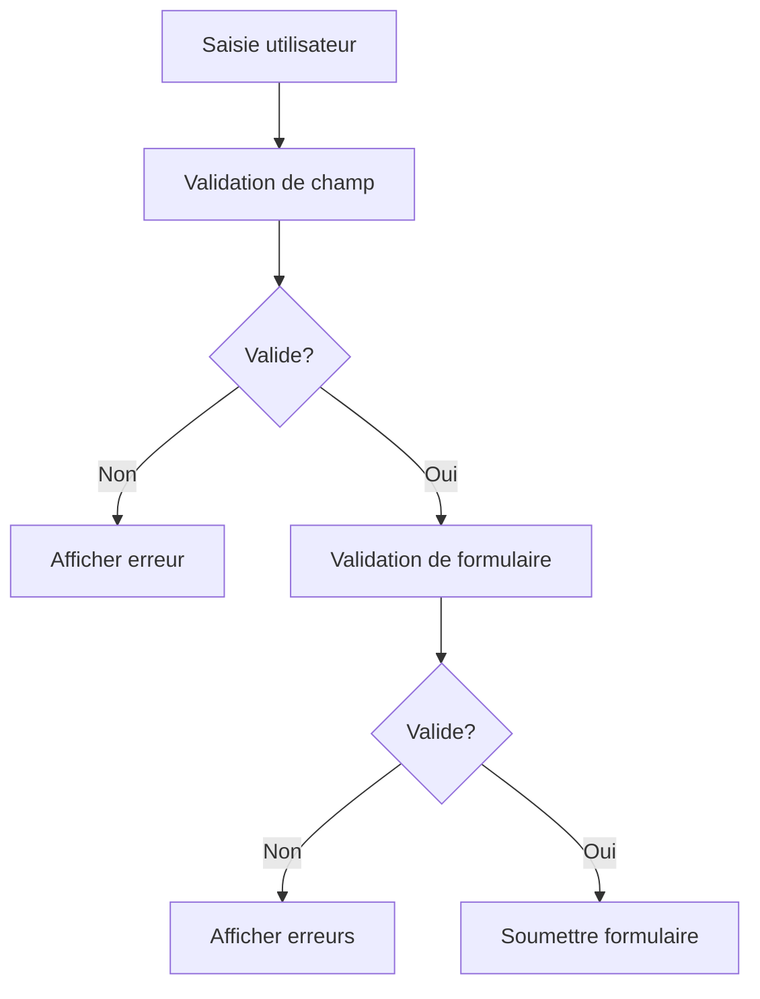

# Validation des Formulaires

Ce document détaille le système de validation des formulaires dans le nouveau système de catalogue.

## Table des matières

1. [Architecture de validation](#architecture-de-validation)
2. [Types de validation](#types-de-validation)
3. [Validation des champs](#validation-des-champs)
4. [Validation des formulaires](#validation-des-formulaires)
5. [Gestion des erreurs](#gestion-des-erreurs)
6. [Tests](#tests)

## Architecture de validation

Le système de validation est composé de plusieurs couches :

```typescript
// Couche de règles
interface ValidationRule {
  type: ValidationType;
  value?: any;
  message: string;
}

// Couche de validation de champ
interface FieldValidation {
  field: string;
  rules: ValidationRule[];
}

// Couche de validation de formulaire
interface FormValidation {
  fields: FieldValidation[];
  dependencies?: FieldDependency[];
  customRules?: CustomValidation[];
}
```

### Flux de validation



## Types de validation

### Validations de base

```typescript
type ValidationType =
  | "required"
  | "min"
  | "max"
  | "pattern"
  | "email"
  | "phone"
  | "date"
  | "custom";

interface ValidationConfig {
  // Règles communes
  required?: boolean;
  min?: number;
  max?: number;
  pattern?: RegExp;

  // Règles spécifiques
  email?: boolean;
  phone?: boolean;
  date?: {
    min?: Date;
    max?: Date;
    format?: string;
  };

  // Règle personnalisée
  custom?: (value: any) => boolean;
}
```

### Exemples de règles

```typescript
// Validation d'email
const emailValidation: ValidationRule = {
  type: "email",
  message: "Format d'email invalide",
};

// Validation de téléphone
const phoneValidation: ValidationRule = {
  type: "pattern",
  value: /^(\+33|0)[1-9](\d{2}){4}$/,
  message: "Format de téléphone invalide",
};

// Validation de date
const dateValidation: ValidationRule = {
  type: "date",
  value: {
    min: new Date(),
    format: "YYYY-MM-DD",
  },
  message: "La date doit être future",
};
```

## Validation des champs

### Configuration des champs

```typescript
interface FormField {
  name: string;
  validation?: ValidationConfig;
  dependencies?: FieldDependency[];
}

interface FieldDependency {
  field: string;
  condition: (value: any) => boolean;
  validation?: ValidationRule;
}
```

### Exemple de validation de champ

```typescript
const addressField: FormField = {
  name: "address",
  validation: {
    required: true,
    custom: async (value) => {
      const isValid = await validateAddress(value);
      return isValid;
    },
  },
  dependencies: [
    {
      field: "country",
      condition: (value) => value === "FR",
      validation: {
        pattern: /^\d{5}$/,
        message: "Code postal français invalide",
      },
    },
  ],
};
```

### Validation en temps réel

```typescript
const useFieldValidation = (field: FormField) => {
  const [value, setValue] = useState<any>();
  const [errors, setErrors] = useState<string[]>([]);

  useEffect(() => {
    const validate = async () => {
      const fieldErrors = await validateField(value, field.validation);
      setErrors(fieldErrors);
    };

    validate();
  }, [value, field]);

  return { value, setValue, errors };
};
```

## Validation des formulaires

### Configuration du formulaire

```typescript
interface FormConfig {
  fields: FormField[];
  validation?: {
    mode: "onChange" | "onBlur" | "onSubmit";
    dependencies?: FormDependency[];
    customValidation?: CustomValidation[];
  };
}

interface FormDependency {
  fields: string[];
  validate: (values: any) => boolean;
  message: string;
}
```

### Exemple de validation de formulaire

```typescript
const movingFormConfig: FormConfig = {
  fields: [
    {
      name: "pickupAddress",
      validation: {
        required: true,
        custom: validateAddress,
      },
    },
    {
      name: "deliveryAddress",
      validation: {
        required: true,
        custom: validateAddress,
      },
    },
  ],
  validation: {
    mode: "onChange",
    dependencies: [
      {
        fields: ["pickupAddress", "deliveryAddress"],
        validate: (values) => {
          return values.pickupAddress !== values.deliveryAddress;
        },
        message: "Les adresses doivent être différentes",
      },
    ],
    customValidation: [
      async (values) => {
        const distance = await calculateDistance(
          values.pickupAddress,
          values.deliveryAddress,
        );
        return distance <= 200;
      },
    ],
  },
};
```

### Hook de validation de formulaire

```typescript
const useFormValidation = (config: FormConfig) => {
  const [values, setValues] = useState<any>({});
  const [errors, setErrors] = useState<Record<string, string[]>>({});
  const [isValid, setIsValid] = useState(false);

  useEffect(() => {
    const validateForm = async () => {
      const newErrors = {};
      let formIsValid = true;

      // Validation des champs
      for (const field of config.fields) {
        const fieldErrors = await validateField(
          values[field.name],
          field.validation,
        );
        if (fieldErrors.length > 0) {
          formIsValid = false;
          newErrors[field.name] = fieldErrors;
        }
      }

      // Validation des dépendances
      if (config.validation?.dependencies) {
        for (const dep of config.validation.dependencies) {
          const isValid = dep.validate(values);
          if (!isValid) {
            formIsValid = false;
            newErrors.form = [...(newErrors.form || []), dep.message];
          }
        }
      }

      setErrors(newErrors);
      setIsValid(formIsValid);
    };

    if (config.validation?.mode === "onChange") {
      validateForm();
    }
  }, [values, config]);

  return { values, setValues, errors, isValid };
};
```

## Gestion des erreurs

### Affichage des erreurs

```typescript
interface ErrorDisplayProps {
  errors: string[];
  field?: string;
}

const ErrorDisplay: React.FC<ErrorDisplayProps> = ({ errors, field }) => {
  if (!errors || errors.length === 0) return null;

  return (
    <div className="error-container">
      {errors.map((error, index) => (
        <p key={`${field}-error-${index}`} className="text-red-500">
          {error}
        </p>
      ))}
    </div>
  );
};
```

### Gestion globale des erreurs

```typescript
interface ErrorState {
  field?: string;
  errors: string[];
  type: "field" | "form" | "server";
}

const ErrorBoundary: React.FC = ({ children }) => {
  const [errors, setErrors] = useState<ErrorState[]>([]);

  const handleError = (error: ErrorState) => {
    setErrors(prev => [...prev, error]);
  };

  return (
    <ErrorContext.Provider value={{ errors, handleError }}>
      {children}
      {errors.length > 0 && (
        <div className="error-summary">
          {errors.map((error, index) => (
            <ErrorDisplay
              key={`error-${index}`}
              errors={error.errors}
              field={error.field}
            />
          ))}
        </div>
      )}
    </ErrorContext.Provider>
  );
};
```

## Tests

### Tests unitaires

```typescript
describe("Field validation", () => {
  it("validates required field", () => {
    const field = {
      name: "test",
      validation: { required: true },
    };

    expect(validateField("", field.validation)).toEqual([
      "Ce champ est requis",
    ]);
    expect(validateField("test", field.validation)).toEqual([]);
  });

  it("validates email format", () => {
    const field = {
      name: "email",
      validation: { email: true },
    };

    expect(validateField("invalid", field.validation)).toEqual([
      "Format d'email invalide",
    ]);
    expect(validateField("test@example.com", field.validation)).toEqual([]);
  });
});
```

### Tests d'intégration

```typescript
describe("Form validation", () => {
  it("validates form with dependencies", async () => {
    const form = {
      fields: [
        {
          name: "pickupAddress",
          validation: { required: true },
        },
        {
          name: "deliveryAddress",
          validation: { required: true },
        },
      ],
      validation: {
        dependencies: [
          {
            fields: ["pickupAddress", "deliveryAddress"],
            validate: (values) =>
              values.pickupAddress !== values.deliveryAddress,
            message: "Les adresses doivent être différentes",
          },
        ],
      },
    };

    const values = {
      pickupAddress: "123 rue A",
      deliveryAddress: "123 rue A",
    };

    const result = await validateForm(values, form);
    expect(result.isValid).toBe(false);
    expect(result.errors.form).toContain(
      "Les adresses doivent être différentes",
    );
  });
});
```

### Tests de performance

```typescript
describe("Validation performance", () => {
  it("validates large form quickly", async () => {
    const start = performance.now();

    // Validation de 100 champs
    const fields = Array.from({ length: 100 }, (_, i) => ({
      name: `field${i}`,
      validation: { required: true },
    }));

    const values = fields.reduce(
      (acc, field) => ({
        ...acc,
        [field.name]: "test",
      }),
      {},
    );

    await validateForm(values, { fields });

    const duration = performance.now() - start;
    expect(duration).toBeLessThan(100); // Max 100ms
  });
});
```

## Bonnes pratiques

1. **Validation progressive**

   ```typescript
   // ✅ Bon
   const validateField = async (value: any, rules: ValidationRule[]) => {
     for (const rule of rules) {
       const isValid = await validateRule(value, rule);
       if (!isValid) return [rule.message];
     }
     return [];
   };
   ```

2. **Messages d'erreur clairs**

   ```typescript
   // ✅ Bon
   const errors = {
     required: "Ce champ est requis",
     email: "Veuillez entrer une adresse email valide",
     phone: "Le numéro doit être au format +33 ou 0 suivi de 9 chiffres",
   };

   // ❌ Mauvais
   const errors = {
     required: "Requis",
     email: "Invalid",
     phone: "Wrong format",
   };
   ```

3. **Validation asynchrone**

   ```typescript
   // ✅ Bon
   const validateAddress = async (address: string) => {
     try {
       const result = await geocodeAddress(address);
       return result.isValid;
     } catch (error) {
       console.error("Erreur de validation d'adresse:", error);
       return false;
     }
   };
   ```

4. **Gestion des dépendances**
   ```typescript
   // ✅ Bon
   const validateDependentFields = (
     values: any,
     dependencies: FieldDependency[],
   ) => {
     return dependencies.every((dep) => {
       const fieldValue = values[dep.field];
       return (
         !dep.condition(fieldValue) || validateField(fieldValue, dep.validation)
       );
     });
   };
   ```

## Conclusion

Un système de validation robuste est essentiel pour :

- Garantir la qualité des données
- Améliorer l'expérience utilisateur
- Prévenir les erreurs
- Faciliter le débogage
- Maintenir la cohérence des données
